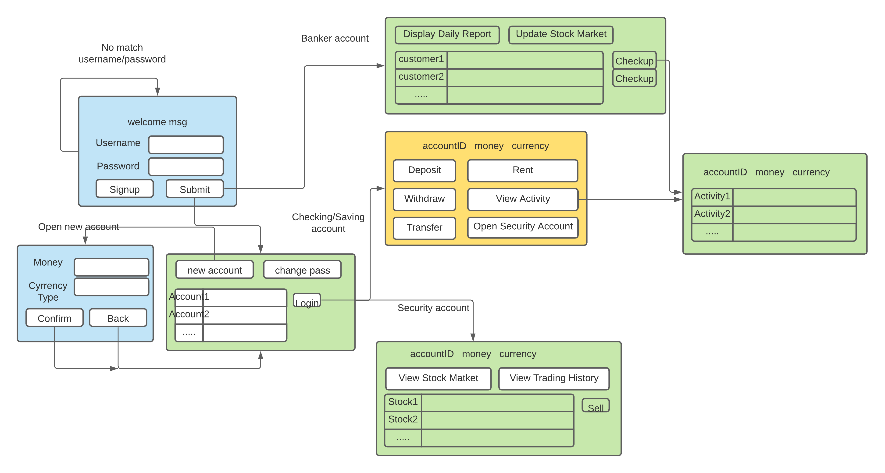

# CS611_Final_Project

### I. Project objective

The task of this final project is to create a bank ATM with Java Swing GUI
that can achieve some functions of an online bank, including deposit, withdraw,
 transfer, loan, stock trading and bank management.

### II. Project design

Our project is mainly divided into four parts: **accounts, assets, controllers** and 
**GUIs**

* **Accounts:**
There are four types of accounts for this ATM: banker account, saving account,
   checking account and security account. 
  
* **Assets:**
Mainly used as assistant class for wrapping and parsing data when read file from
  csv file. 
  
* **Controllers:**
Contain different types of controllers used for controlling(reading and writing) data from different csv files.
  
* **GUIs:**
Classes for creating all the GUIs of the ATM.

For data storage, we chose to store data into csv files in data folder.

### III. Main GUI introduction
* **AccountWindow:** The desktop of saving/checking account, from where window of available
services can be open.

* **ActivityHistoryFrame:** Window for displaying the activity histories of the
account.
  
* **BankerAccountMainFrame:** The desktop of the banker account, which will display
all the accounts in the bank divided by account type, from where can enter stock edit
  panel and daily report window. Also right click the row of a certain account can
  check up that account.
  
* **CustomerMainFrame:** Main window for customer after logging in. Will display
all the accounts the customer have. Can enter the main menu of a certain account by
  double clicking the row of the account.
  
* **SecurityAccountMainFrame:** Desktop of security accounts. Will display all the
stocks the account has. Customer can sell their stocks at latest price by right
  clicking the row of a certain stock. Also can enter stock market or view trading
  history click corresponding buttons at the bottom.
  
* **StockMarketFrame:** Window for displaying the stock information. Can refresh by
clicking the refresh button on the left top. Right click the stock can choose
  to buy it.
  
* **StockDataManagementMainFrame:** Window of editing the data of the stocks. Is only
used by banker account. Can add a new stock data at the left panel or delete existing stock data
  by right clicking the table. Also double click certain cell of the table can 
  edit the data of that cell.
  
The main GUI structure is shown as below:

### IV. Running command

* **For Windows:**

`cd src`

`javac -cp ".;/../commons-lang3-3.11.jar;../opencsv-5.3.jar" BankATM.java`

`cd ..`

`java -cp src BankATM`

* **For macOS and Unix:**
  
`cd src`

`javac -cp ".:/../commons-lang3-3.11.jar:../opencsv-5.3.jar" BankATM.java`

`cd ..`

`java -cp src BankATM`